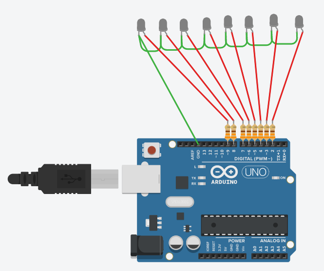

# Led Display Which Shows Given Text Inside The Code With Arduino.
## Requirements
*1. Arduino Developement Board
*2. wires
*3. 8 LEDs
## Connections
### Connect All Components As Showen In The Diagram

## Code Is Inside Code Folder In `.ino` File. Just Upload And Have Fun.#  
#  
